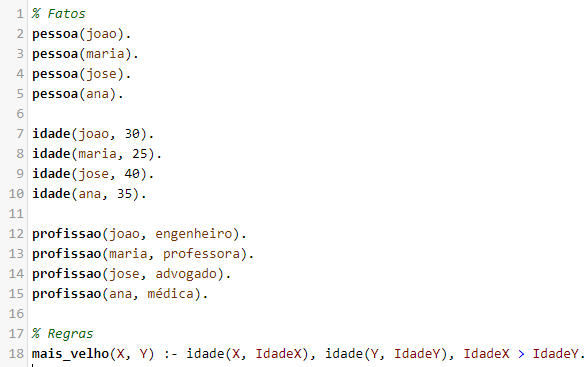

# Questão 2

### A partir desse código, qual seria o resultado, ou o que indicam, em relação as seguintes consultas:
1. pessoa(joao).
2. idade(maria, Idade).
3. profissao(X, engenheiro).
4. mais_velho(joao, maria).

### Qual dessas regras seria possível para que todos, com pelo menos 70 anos, fossem considerados aposentados:

1. profissao(X, aposentado) :- idade(X,Y), Y>=70.
2. profissao(X, Y) :- idade(X,Z), Z>=70, Y=aposentado.
3. idade(X,Y) :- profissao(X, aposentado), Y >= 70.